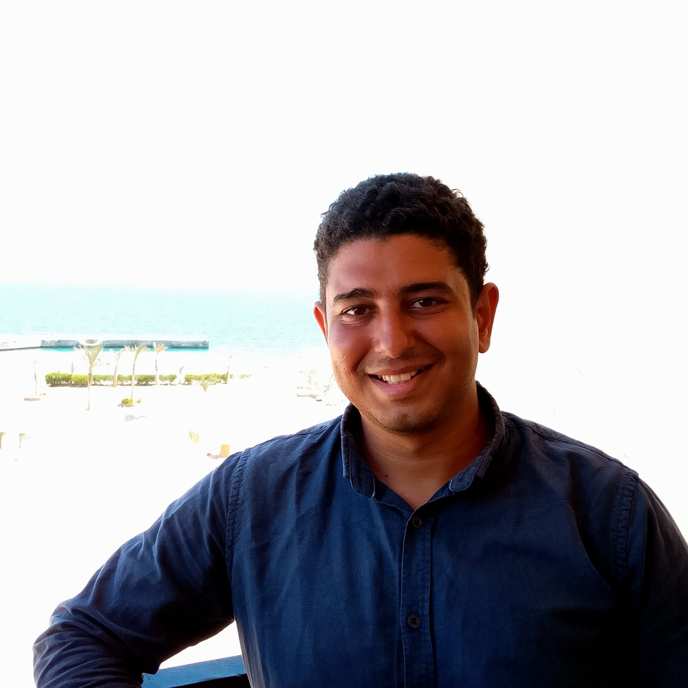

# Mina Maged Zekry Gayid

**Dentist · Dental Clinic Owner · MBA Candidate**
Aswan, Egypt

---

## 👋 About Me

I'm a practicing **dentist and dental clinic owner** based in Aswan, Egypt, graduated with the **highest honors** from MSA University's Faculty of Dentistry. Alongside clinical practice, I'm expanding into **healthcare management and business**, currently pursuing an **MBA** at the Arab Academy for Science, Technology & Maritime Transport.

I care about combining quality patient care with sound operations — running a clinic taught me as much about people, systems, and decision‑making as dentistry did. I'm increasingly interested in how **data and technology** can improve healthcare delivery, and I'm building skills in data analysis and programming to bridge that gap.

## 💼 Professional Experience

- **Happy Dental Clinic** — *Owner & Operator* (2023 – present)
  Founded and run a private dental practice: clinical care, staff, scheduling, and day‑to‑day operations.
- **Egypt Healthcare Authority** — *Dentist, Elgozayra Family Medicine Unit* (2022 – 2024)
  Delivered primary dental care within Egypt's public family‑medicine system.

## 🎓 Education

- **Arab Academy for Science, Technology & Maritime Transport** — *Master of Business Administration (MBA)* (2025 – present)
- **MSA University** — *Bachelor of Dentistry* (2015 – 2020)
  GPA **3.72** · Graduated with **Highest Honors**

## 📜 Certifications

- Basic Implant Course — Cairo Dental Syndicate (2021)
- Basic Life Support (BLS) — Egypt Healthcare Authority (2023)
- ICDL (International Computer Driving Licence) — Cairo University (2021)
- Mini MBA — Udemy (2020)

## 🧠 Skills

**Clinical & Professional**
Dentistry · Dental implants · Patient care · Clinic management & operations

**Business & Analytics**
Business administration · Data analysis (Power BI, SQL, Tableau) · Microsoft Office (Word, Excel, PowerPoint, Teams)

**Technical (foundational)**
HTML · CSS · JavaScript · Python · Cloud basics (AWS, Azure)

**Languages**
Arabic (native) · English (C1)

**Strengths**
Communication & teamwork · Organization & time management · Problem‑solving & analytical thinking

## 🌱 Currently

- Studying toward my MBA while growing Happy Dental Clinic
- Building practical skills in data analysis and programming
- Open to collaboration at the intersection of **healthcare, business, and technology**

## 📫 Get in Touch

- 📧 **Email:** [minagayid@gmail.com](mailto:minagayid@gmail.com)
- 💼 **LinkedIn:** [mina-maged-zekry-gayid](https://www.linkedin.com/in/mina-maged-zekry-gayid-6b5b3a137)
- 🐙 **GitHub:** [@minagayid](https://github.com/minagayid)

Thanks for stopping by 👋

